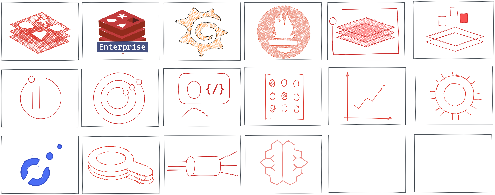

# Redis and Grafana icons for Excalidraw

A collection of Redis and Grafana related icons for [Excalidraw](https://excalidraw.com/):

- Redis and Redis Enterprise
- Grafana and Prometheus
- RedisGraph, RedisGears, RedisTimeSeries.
- Redis Data Source and Redis Application plug-ins

## What is Excalidraw Libraries?

A huge time-saver! A directory of [public libraries](https://libraries.excalidraw.com/?sort=default) that you can easily add to Excalidraw.

## Animate

Do you want to convert Excalidraw drawing into animation? Take a look at [Excalidraw-animate](https://dai-shi.github.io/excalidraw-animate/).

## Stop-motion

Do you want to take your Excalidraw one step further? Take a look at an [experimental tool to create stop motion animations](https://dai-shi.github.io/excalidraw-claymate/).

## Contributing

- Fork the repository.
- Add or improve [redis-grafana.excalidraw](redis-grafana.excalidraw).

## License

MIT, see [LICENSE](LICENSE).
